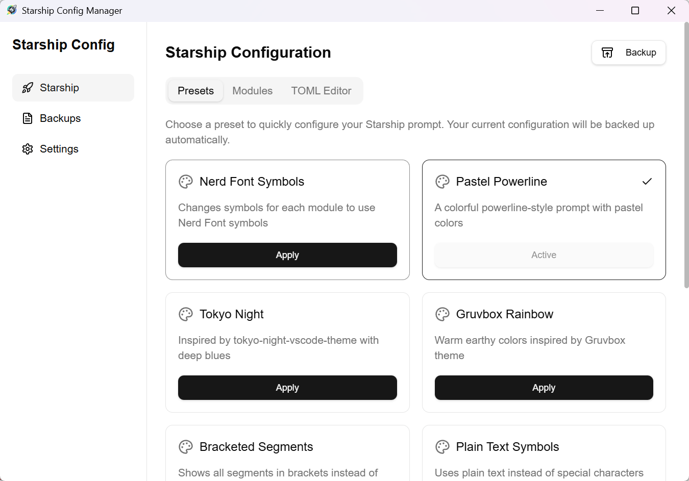
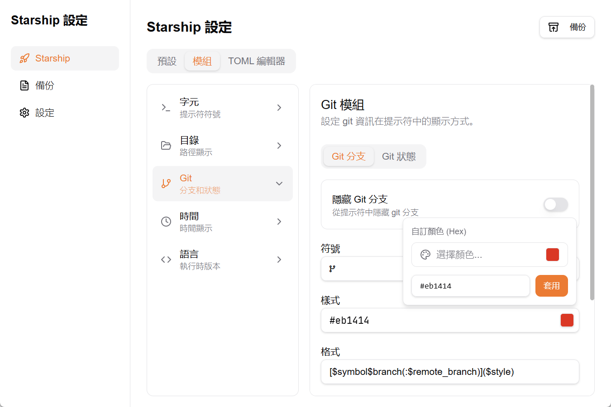

<div align="center">
  
</div>

# Starship 配置管理器

`Starship Config Manager` 是一款桌面應用程式，透過視覺化介面協助您管理 [Starship](https://starship.rs/) 提示符設定。此應用程式採用 [Tauri](https://v2.tauri.app/) 打造，支援 `Windows` 系統。

它提供簡單易用的圖形介面來設定 Starship 提示符，包含：

- **預設選擇** - 9 個內建主題（Nerd Font Symbols、Pastel Powerline、Tokyo Night 等）
- **模組編輯器** - 設定各個提示符模組（字元、目錄、Git、時間、語言）
- **TOML 編輯器** - 直接編輯原始 `starship.toml` 檔案
- **備份管理** - 建立、還原、重新命名與刪除設定備份

[English](./README.md) | 繁體中文 | [简体中文](./README-zh_CN.md)

## 目錄

- [截圖](#截圖)
- [安裝](#安裝)
  - [下載](#下載)
- [移除](#移除)
  - [Windows 移除](#windows-移除)
- [開發與建置](#開發與建置)
  - [開發](#開發)
  - [建置與封裝](#建置與封裝)
- [功能特色](#功能特色)

## 截圖

<div align="center">
  
</div>

<div align="center">
  
</div>

<details>
  <summary><h2 style="display:inline-block;">您需要了解的內容</h2></summary>

與 `Starship Config Manager` 相關的所有檔案都位於系統的設定目錄中：

- **設定目錄**：`%APPDATA%\starship-config-manager\` (Windows)
  - `settings.json` - 儲存應用程式設定（主題、語言）
  - `backups/` - 包含所有 Starship 設定備份

- **Starship 設定**：`%USERPROFILE%\.config\starship.toml`（實際被修改的 Starship 設定檔）

### 備份檔案

備份使用時間戳格式命名：`starship_YYYYMMDD_HHMMSS.toml`（例如：`starship_20240118_143025.toml`）

自訂備份名稱存放於瀏覽器的 localStorage，不會影響實際檔名。

</details>

## 安裝

### 下載

您可以下載原始碼自行建置，或從 GitHub 發佈頁面下載已建置的版本。

- [Starship Config Manager 發佈頁面](https://github.com/YOUR_USERNAME/starship-config-manager/releases)

## 移除

### Windows 移除

1. 移除 `Starship Config Manager` 應用程式
2. 刪除設定目錄：`%APPDATA%\starship-config-manager\`
3. 可選：刪除 Starship 設定：`%USERPROFILE%\.config\starship.toml`

## 開發與建置

### 前置需求

- **Rust** - Tauri 後端所需。請至 [rust-lang.org](https://www.rust-lang.org/learn/get-started) 安裝
- **Node.js** - 前端所需。請至 [nodejs.org](https://nodejs.org/) 安裝
- **pnpm** - 套件管理器。請至 [pnpm.io](https://pnpm.io/) 安裝

### 開發

將專案程式碼複製到本機，切換到專案根目錄後，在終端機執行以下指令：

```bash
# 安裝依賴
pnpm install

# 啟動開發伺服器
pnpm dev
```

或者，若您已安裝 Tauri 擴充套件，可在 VSCode 中按 `F5` 以除錯模式啟動。

### 建置與封裝

```bash
# 建置正式版
pnpm build
```

若一切順利，封裝檔案會位於 `./src-tauri/target/release/bundle/` 目錄中。

## 功能特色

- [x] **9 個內建預設** - 快速套用精美主題（Nerd Font Symbols、Pastel Powerline、Tokyo Night、Gruvbox Rainbow 等）
- [x] **模組編輯器** - 透過直覺表單設定 Starship 模組：
  - 字元 - 自訂成功/錯誤/vim 符號與樣式
  - 目錄 - 設定截斷、樣式與主目錄符號
  - Git - 設定 git 分支與狀態符號
  - 時間 - 在提示符顯示目前時間
  - 語言 - 管理執行環境版本（Node.js、Python、Rust、Go 等）
- [x] **TOML 編輯器** - 直接編輯 `starship.toml`，並支援備份/還原功能
- [x] **備份管理** - 輕鬆建立、還原、重新命名與刪除備份
- [x] **即時預覽** - 在終端機即時查看更改（需重啟終端機）
- [x] **多語系支援** - 英語與簡體中文
- [x] **主題支援** - 淺色、深色與系統主題
- [x] **TypeScript** - 完整 TypeScript 支援，確保型別安全
- [x] **現代化 UI** - 使用 React 19、Tailwind CSS 4 與 shadcn/ui 元件

## 技術棧

- **前端**：React 19 + TypeScript
- **後端**：Rust + Tauri v2
- **建置工具**：Vite
- **樣式**：Tailwind CSS v4
- **UI 元件**：shadcn/ui (Radix UI)
- **資料管理**：TanStack Query (React Query)
- **表單**：React Hook Form + Zod
- **圖示**：Lucide React
- **套件管理器**：pnpm

## 授權

MIT 授權 - 詳情請參閱 [LICENSE](./LICENSE) 檔案

## 致謝

- [Starship](https://starship.rs/) - 適用於任何 shell 的極簡、快速且高度可自訂提示符
- [Tauri](https://tauri.app/) - 建構更小、更快、更安全的桌面應用程式
- [shadcn/ui](https://ui.shadcn.com/) - 使用 Radix UI 打造的精美元件
- [nvm-desktop](https://github.com/1111mp/nvm-desktop) - 專案架構參考
